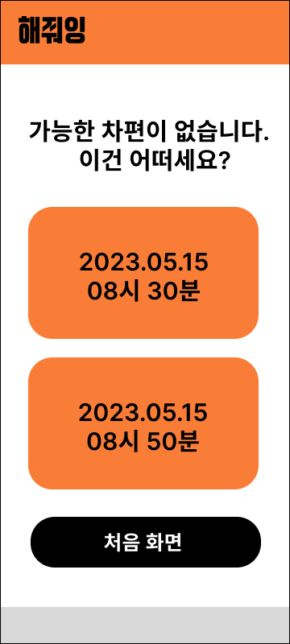
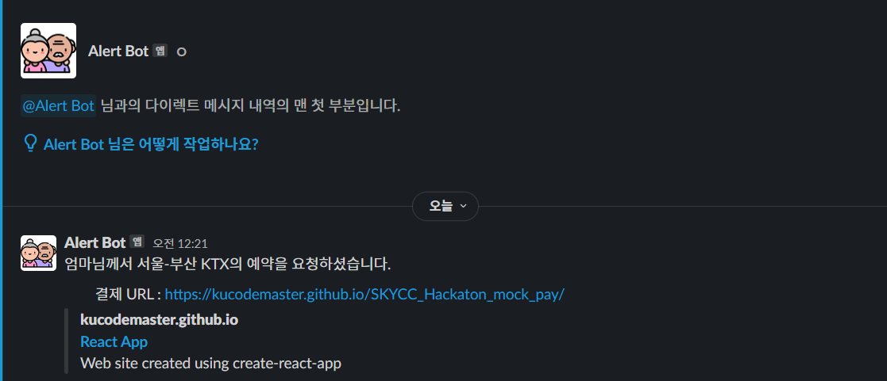
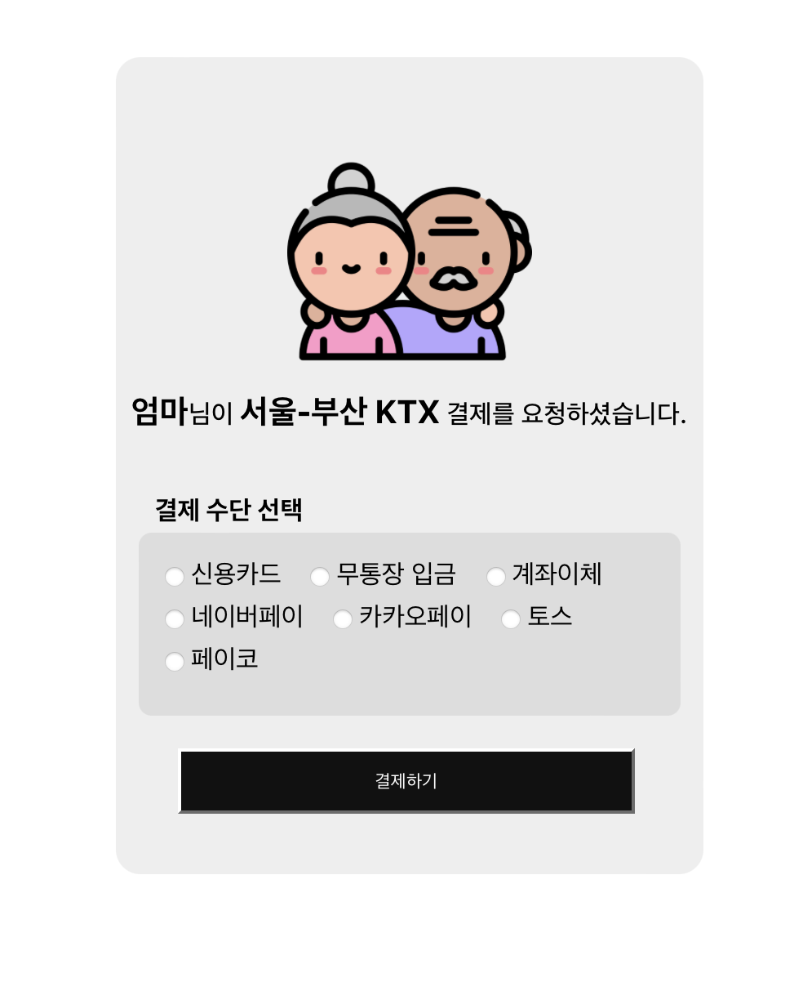

> **💡  한줄소개: 60대 이상 고령층을 위한 고령층 친화 예약 서비스**

# Problem.

스마트폰으로 모든 것이 이뤄지는 세상에 사는 요즘,

어느 가게를 가든 키오스크를 어렵지 않게 만날 수 있고, 
간편하게 모바일로 예매는 물론 은행 업무도 볼 수 있게 되었다.

지난 코로나19사태는 이러한 정보화 흐름을 더욱 가속화시켰다.

**그런데 젋은 세대보다 상대적으로 디지털 환경이 낯선 고령층에게는,
이러한 디지털화가 그저 두려움의 대상일 뿐이다.**


위 자료에서 볼 수 있듯,  60대 이상 고령층의 디지털정보화 수준은 일반 국민에 비해 한참 못미친다.

**그렇다면, 그 까닭은 무엇일까?**

**고령층은 왜 편리한 디지털(온라인) 서비스를 사용하지 않는 것일까?**

그 이유는 아래 자료를 보면, 알 수 있다.     


대다수의 고령층이 ‘사용 방법을 모르거나 어려워서’ 라는 이유로, 그 디지털 서비스의 사용을 거부하거나, 혹은 거부 당하고 있다. 그러나 기술의 발달로 인한 사회의 디지털화는 피할 수 없는 현실이다.  최근 인공지능이 발달하며, 사회의 정보화는 더욱 가속화되고 있다. 이러한 사회 흐름 속에서 고령층은 점점 이 사회로부터 소외받고 있다.

**고령층이 겪는 정보 격차는 매우 심각하다.**  

# Solution. 음성 기반 예약 서비스: 해줘잉

본 서비스는 우리 사회의 숙원 과제인 위 고령층의 정보 격차를 문제를 해소하기 위해 고안되었다.

**고령층을 이 정보화 사회에 화합🤝시키는 것, 
그것이 본 서비스의 궁극적인 목표다.**

본 팀은 특히 대부분의 영역에서 디지털화가 이루어진 예약 서비스에 집중하였으며,

(주어진 시간을 고려하여) 그 중에서도 고령층이 주로 이용하는 KTX(교통)에 적용하여 구현하였다.

본 서비스의 **핵심적 특징**은 아래와 같다. 

- 고령층에게 특화된 사용자 경험을 제공하기 위한 STT (Speech-to-Text) 기술 사용
- 고령층 친화 UI/UX (간결한 UI/UX 화면과 UX FLOW)

# 구현한 기능

**[Main Repo]**

[GitHub - DevKor-github/SKYCC: SKYCC Team 고서연](https://github.com/DevKor-github/SKYCC)

**[결제 페이지 Repo]**

[GitHub - KUcodemaster/SKYCC_Hackaton_mock_pay](https://github.com/KUcodemaster/SKYCC_Hackaton_mock_pay)

구현한 **주요 기능**은 아래와 같다.


**💡 목표: 원클릭(One Click) - 원스피치(One Speech) 예약**
<br/>


- 1. (예약 요청) 음성 인식 후 텍스트 변환 ✅
    
    - 1. 프론트엔드 측에서 음성 녹음 후 http request 

    - 2. 백엔드 측에서 음성 녹음 파일을 AWS S3에 업로드 
    
    - 3. S3에 업로드된 음성녹음 파일을 AWS-transcribe를 이용하여 Text로 변환 
    
    - 4. openai api(chatgpt)를 이용하여 변환된 text를 형식에 맞게 전처리 
    
    - 5. 전처리된 text data로 DB에 query 
    
- 2. 요청한 예약 정보와 가장 유사한 차편을 교통편 DB 상에서 탐색 후 임시 예약 ✅
    
    - 1. 요청에 맞는 정확한 차편이 있을 경우, 바로 해당 차편 임시 예약
    
      - DB에는 korail data api를 이용하여 ktx 기차편 정보가 모두 등록되어 있음
      - 요청에는 출발 역, 도착 역, 출발 시간이 포함됨
      - 해당 데이터와 일치하는 차편이 있을 경우 임시 예약 처리
    
    - 2.  요청에 정확히 맞는 차편은 없을 경우, 유사한 차편 3개 대안으로 제공 후  
    
      - 유사한 차편은 출발 역, 도착 역이 일치하고, 출발 시간 차이가 적은 순으로 3개의 record를 제공
      - 사용자에게 대안 3가지는 편리하고 알아보기 쉬운 UI로 제공, 클릭 시 임시 예약 처리
- 3. 임시 예약 완료 시, 슬랙봇을 통해 (시니어인 사용자의 자녀분께) 임시 예약 및 결제 안내 메세지 발송 ✅
    - 만약, 예약 과정에서의 시니어의 실수 또는 기술적 에러는 예약 확인 과정에서 handling 가능
    - 에러가 있다면, 임시 예약 취소 가능

- 4.  슬랙 결제 안내 메세지에서 연결되는 결제 페이지 ✅

- 5. 결제 완료 시 최종 예약 확정 (예정)

( ✅ :구현 완료 상태를 의미 )

# 기능 구현 방식

### 아키텍처


### 인프라

- **AWS S3** : 음성 파일 및 STT 변환 결과 저장 

- **AWS Transcribe** : 음성 파일 STT 변환

- **AWS RDS** : KTX Data 저장 및 사용자 예약 정보 저장

- **AWS EC2** : 배포 및 서버 구동 

- **Vercel** : 프론트 서버 배포

### 기술스택
- **Front** : Nextjs
    - PWA(progressive web app)으로 빠른 웹앱 구현
    - ‘react-recorder-voice’ 라이브러리의 useRecorder 훅을 이용하여 음성 녹음 및 음성 파일 전송 구현

- **Back** : Nestjs + postgresql

### 사용 API 

#### 1) Open AI ChatGpt

- Prompt Engineering을 통한 자연어처리
    - 최종 Prompt = STT로 변환한 유저의 요청 prompt + Service Prompt
    - STT로 변환한 요청 prompt 예시
        
        ```
        오월 십오일 서울에서 부산가는 기차아홉시 편 예매해줘.
        ```
        
    - Service Prompt 예시
        
        ```
        에서 날짜와 시간, 출발지, 목적지를 구분해줘. 날짜는 2023-MM-DD, 시간은 HH:MM으로 표기하고 출력은 json 형식만 해줘. 구체적인 형식은 다음과 같아\n. {"date": 날짜\n,"time": 시간\n,"departure": 출발지\n,"destination": 목적지}
        ```
        

#### 2) AWS Transcribe

- S3에 저장한 mp4 파일을 AWS Transcribe SDK를 활용하여 STT(Speech to Text) 변환 후 S3에 JSON 형식으로 결과 저장

#### 3) Slack

- **슬랙 봇** 구현으로 임시 예약 정보를 토대로 결제 페이지로 연결되는 url을 알림 메세지로 제공
- 결제 페이지에서는 임시 예약 취소 기능 구현 예정

#### 4) Korail data API

- 존재하는 기차표 정보 제공

# 팀원 간 업무 분담

### 팀원 소개
<p>
<a href="https://github.com/overthestream">
    
</a>
<a href="https://github.com/KUcodemaster">
    
</a>
<a href="https://github.com/dhdbsrlw">
    
</a>
<a href="https://github.com/tjrdnjs1534">
    
</a>
<a href="https://github.com/ryuni-dev">
    
</a>
</p>

### 각 팀원 별 스택
- 노정훈 : 풀스택
  
- 신재훈 : 프론트

- 오윤진 : 프론트, 데이터 분석

- 장석원 : 풀스택

- 정경륜 : 풀스택
    

### 업무 분담
- STT 음성 파일을 받아 서버에서 API에 요청(w/ AWS TRISCRIBE) - **장석원, 정경륜**
- Speech Text 전처리 (w/ ChatGPT API) - **정경륜**
- 백엔드(교통편 및 예약 관련 기능 , 인프라 관리) - **노정훈**
- 프론트엔드 - **신재훈, 정경륜, 오윤진**
- 슬랙봇 구현(메세지 알림) - **신재훈**

<br/>

# 서비스 시연 화면

```
<예시 입력>
'5월 23일 오전 8시 서울에서 부산으로 가는 기차를 예약해줘' 
```

### [ 사용자 화면 ]
<p align="center">
    
    
    
    
</p>


### [ 슬랙 알림 메세지 ]

<p align="center">
    
</p>

### [ 외부 결제 페이지 (자녀 측 화면) ]

<p align="center">
    
</p>

<br/>

# 확장가능성 1. 기능 확장 측면

**Phase 1. 고령층이 자주 이용하는 서비스 분야로 예약 범위 확장**

- 병원 예약
- 음식점 예약
- 버스 예약


**Phase 2. 예약 밖의 핵심 기능 추가 (음성 기반 종합 시니어 지원 서비스로서의 도약)**

- 고령층 전용 소모임 매칭 기능 등

<br/>

# 확장가능성 2. 사업화 측면

### 2-1. 실버산업 현황

실버 산업은 크게 **3가지 분야**로 나뉜다.

- **돌봄 분야**
  - 요양보호사 중개 및 방문 요양 서비스 (예시: 스마일시니어, 하이케어 등)  
  - 인공지능을 활용한 말벗 서비스 
  - 복약 또는 식사시간, 긴급 상황 알림 서비스 
  - 생필품 구매 대행 또는 가전 수리/설치 등 생활 도움 서비스

- **여가/사회참여 분야**
  - 시니어 취미(클래스) 및 액티비티 중개 (예시: 시소 등)

- **교육 분야**
  - 디지털 교육

<br/>

### 2-2. 실버산업 전망

대한민국은 초고령사회를 눈앞에 두고 있다. 지난해 통계청 발표 자료에 따르면, **우리나라는 2년 뒤인 2025년** 65세 이상 고령인구가 1000만명을 돌파하는 **초고령사회에 진입할 전망이다.** 실버산업 시장 규모도 2030년까지 최대 168조원에 이를 것이라는 예측이 나오고 있다.

<br/>

### 2-3. 본 서비스에 접목 가능한 BM 아이디어

- **서비스 정기 구독에 대한 구독 수수료**

  - 고령층 사용자의 자녀가 해당 금액을 지불한다. 

- **추가 기능 오픈 시 해당 서비스에 대한 프리미엄화**

  - ✅ 서비스 **대체불가능성**에 따른 락인(lock-in) 효과 발생 → 지속적인 수익 발생 기대

    - 한 번 맛 본 편리함이란, 포기하기 쉽지 않다.

<br/>

### 2-4. 서비스의 대체 불가능성 (유사 서비스 비교)

#### 2-4-1. STT 기반 예약서비스

STT 기술을 활용한 예약 서비스 자체는 다수 존재하나, UI/UX 측면에서 간결한 서비스는 찾기 어렵다. 다시 말해, 이는 같은 기술을 활용한 서비스이지만 고령층이 사용하기에 부적합하다. 고령층에게 특화된 사용자 경험을 제공한다는 점에서 본 서비스는 차별성을 지닌다.

#### 2-4-2. 고령층 대상 서비스 (실버산업) 

직접적으로 예약 서비스, 특히 교통편 예약 기능 제공하는 서비스는 찾을 수 없었다. 다만, 코레일 자체에서 고령층 특화 키오스크를 개발하려는 시도는 존재하였다. 이러한 측면에서  본 서비스는 유일성을 지닌다.

<br/>

# 기타
### 발표자료 링크
<p align="center">
  <a href="https://docs.google.com/presentation/d/1uFlUNrmou4DCLL2DH4_KXVwoVK65CNbxprseqPBKJyc/edit?usp=sharing">https://docs.google.com/presentation/d/1uFlUNrmou4DCLL2DH4_KXVwoVK65CNbxprseqPBKJyc/edit?usp=sharing</a>
</p>

<br/>

감사합니다.

지금까지 팀 **고서연** 이었습니다.